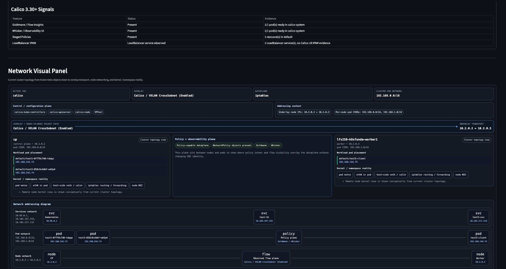
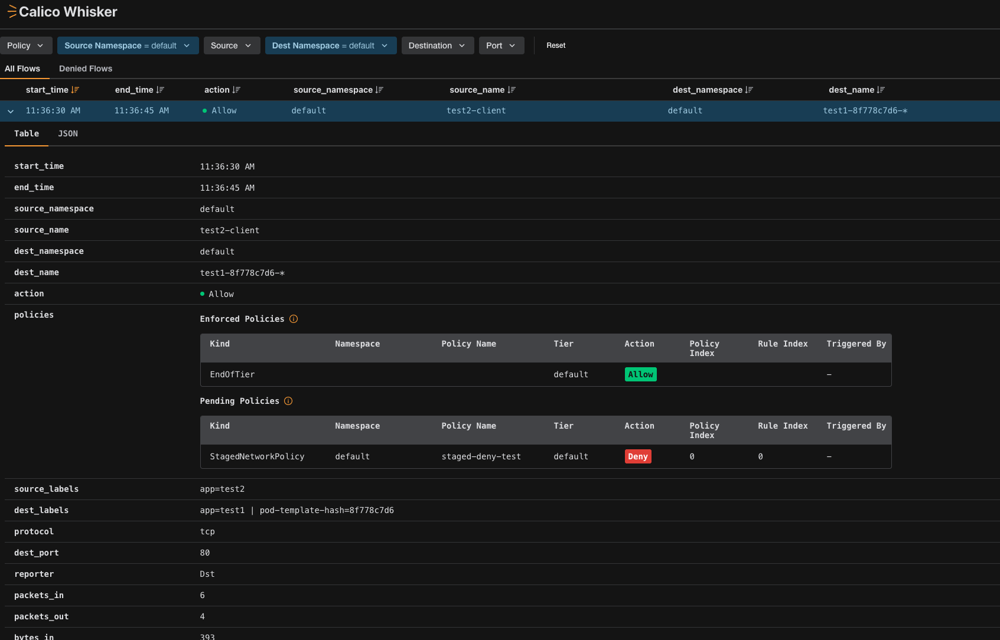

# Learning Moment: Residual CNI State Causing Silent Dataplane Failure

## Summary

A Kubernetes cluster appeared healthy at the control plane and workload level, but pod-to-pod communication across nodes was failing. The root cause was residual CNI artifacts (Cilium) conflicting with the active CNI (Calico), resulting in a broken dataplane despite a seemingly correct cluster state.

This learning moment demonstrates why **"Everything Lives Somewhere (ELS)" reasoning is critical** — Kubernetes objects alone do not guarantee dataplane correctness.

---

## Scenario

### Cluster State (Observed)

- Nodes: Ready
- Pods: Running
- Services: Created
- DNS: Configured
- CNI: Detected as **Calico (VXLAN CrossSubnet)**

### Expected Behavior

- Pod-to-pod communication across nodes should succeed
- Service ClusterIP should be reachable
- Whisker should show flows

### Actual Behavior

- `curl` from one pod to another **times out**
- Service access fails
- No flows visible in Whisker initially

---

## Investigation (ELS Model Walkthrough)

### L7-L5: Kubernetes Objects

- Pods exist and are scheduled correctly
- Service endpoints correctly point to pod IPs
- No obvious issues in Kubernetes resources

👉 At this level, everything appears **healthy**

### L4.3: Node Agents & Networking (Critical Layer)

cka-coach revealed:

- Active CNI: Calico
- Overlay: VXLAN
- Dataplane: iptables

However, node inspection showed:

```bash
ip link show | grep -E 'cilium|vxlan|cali'
```

Output included:

```text
cilium_vxlan
cilium_host
cilium_net
vxlan.calico
```

👉 Multiple CNI dataplanes present simultaneously

### L1-L2: Kernel / Dataplane Reality

From the worker node:

- Routes existed for Calico VXLAN
- Interfaces from both Cilium and Calico existed

From `tcpdump`:

```bash
tcpdump -ni ens4 udp port 4789
```

Initially:

- ❌ No VXLAN traffic observed

After cleanup:

- ✅ VXLAN traffic observed between nodes
- `10.2.0.2 ↔ 10.2.0.3 : UDP 4789`
- `VNI: 4096`

---

## Root Cause

Residual Cilium network interfaces and dataplane state remained after switching to Calico.

This caused:

- Traffic routing ambiguity
- VXLAN encapsulation failure
- Silent packet drops between nodes

---

## Resolution

Removed residual Cilium interfaces:

```bash
sudo ip link delete cilium_vxlan
sudo ip link delete cilium_host
sudo ip link delete cilium_net
```

Exact commands may vary depending on environment.

---

## Verification

### 1. Pod-to-Pod Communication

```bash
kubectl exec test2-client -- curl http://<test1-pod-ip>
```

✅ Success after cleanup

### 2. Service Connectivity

```bash
kubectl exec test2-client -- curl http://test1-svc
```

✅ Service reachable

### 3. VXLAN Traffic

```bash
tcpdump -ni ens4 udp port 4789
```

✅ Continuous VXLAN packets observed

### 4. Whisker Flow Visibility

- Source: `test2-client`
- Destination: `test1`
- Action: `Allow`
- Protocol: `TCP/80`

### 5. Policy Awareness (Calico 3.30+)

Whisker showed:

- Enforced policy: `Allow (EndOfTier)`
- Pending policy: `staged-deny-test -> Deny`

👉 Demonstrates safe policy staging:

Traffic is currently allowed, but would be denied if policy is enforced.

### Outcome in cka-coach

Once VXLAN traffic was restored and the dataplane was functioning properly, cka-coach reflected the recovered networking state and associated Calico 3.30+ signals:



### Outcome in Whisker

Whisker then showed the recovered flow, along with both enforced and staged policy context:



---

## Key Learning

### 1. Kubernetes != Network Truth

A healthy Kubernetes API does **not** guarantee a working dataplane.

### 2. CNI Is a Kernel-Level System

Lives at ELS `L4.3 -> L1`.

Must be validated at:

- interfaces
- routes
- encapsulation
- packet flow

### 3. Residual State Is Dangerous

Switching CNIs without cleanup can leave:

- orphaned interfaces
- conflicting routes
- broken encapsulation paths

### 4. Observability Must Span Layers

| Layer | Tool |
| --- | --- |
| Kubernetes | `kubectl` |
| Node | `ip` / `route` / `link` |
| Dataplane | `tcpdump` |
| Policy | `Whisker` / `Goldmane` |
| Reasoning | `cka-coach` |

### 5. Staged Policy = Safe Experimentation

Calico staged policies allow:

- Previewing impact
- Observing flows
- Avoiding accidental outages

---

## Why This Matters (cka-coach Perspective)

This scenario highlights the core purpose of cka-coach:

To help learners understand where things actually live, not just how to operate Kubernetes.

cka-coach enabled:

- Detection of CNI identity and mismatch
- Visualization of node-level networking reality
- Correlation of policy, flows, and dataplane behavior

---

## Takeaway

> "If you only look at Kubernetes, everything works.  
> If you look at the dataplane, you see the truth."

---

## Suggested Exercises

1. Install Cilium, then switch to Calico without cleanup
2. Observe broken pod-to-pod communication
3. Use cka-coach to identify inconsistencies
4. Validate at kernel level (`ip link`, `tcpdump`)
5. Clean up residual interfaces
6. Verify restoration of connectivity
7. Add a staged policy and observe in Whisker

---

## Tags

- CNI
- Calico
- Cilium
- VXLAN
- Dataplane
- Troubleshooting
- ELS Model
- Staged Policies
